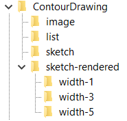

# csci1430-final-project
## One-line installation (with Conda environments)
`conda env create -f environment.yml`

Then activate the environment (sketch) and you are ready to go!

# Train & test on our contour drawing dataset

- Download the images and the rendered sketch from the [project page](http://www.cs.cmu.edu/~mengtial/proj/sketch/)
- Unzip and organize them into the following structure:

- Modify the path in `scripts/train.sh` and `scripts/test.sh`
- From the repo's **root directory**, run `scripts/train.sh` to train the model
- From the repo's **root directory**, run `scripts/test.sh` to test on the val set or the test set (specified by the phase flag)

## Acknowledgement
This code is based on an old version of [PhotoSketch](https://github.com/mtli/PhotoSketch/).

